# Markdown Issue Index

Generated by derive-tracker.wasm

## Ready Queue

No ready issues.

## Unresolved Issues

| ID | Status | Priority | Type | Assignee | Blocked by | Blocks | Title |
| --- | --- | ---: | --- | --- | --- | --- | --- |
| [ISS-013](ISS-013.md) | deferred | 4 | feature | unassigned | none | none | Add deterministic font-dependent text analysis |

## Dependency Graph

```mermaid
graph TD
  ISS_001["ISS-001: Extract declared visual facts for a solid rect"]
  ISS_002["ISS-002: Make style precedence independent of attribute order"]
  ISS_003["ISS-003: Resolve inherited fill with source provenance"]
  ISS_004["ISS-004: Deliver the planned SVG diff product slices"]
  ISS_005["ISS-005: Prevent false complete equality outside analysis coverage"]
  ISS_006["ISS-006: Align multiple visual subjects without authoritative IDs or order"]
  ISS_007["ISS-007: Enumerate supported changed facts across all aligned subjects"]
  ISS_008["ISS-008: Localize visual events with conservative difference regions"]
  ISS_009["ISS-009: Attach causally complete conservative cause envelopes"]
  ISS_010["ISS-010: Measure and order differences by domain"]
  ISS_011["ISS-011: Publish the stable JSON API and command-line interface"]
  ISS_012["ISS-012: Generate the self-contained interactive HTML diff report"]
  ISS_013["ISS-013: Add deterministic font-dependent text analysis"]
  ISS_014["ISS-014: Guard unresolved renderer style precedence"]
  ISS_015["ISS-015: Complete the recorded v1 comparison profile"]
  ISS_016["ISS-016: Preserve source diffs across unsupported compositing and resources"]
  ISS_017["ISS-017: Isolate presence painted coverage from scene content"]
  ISS_018["ISS-018: Close container localization and gradient coverage gaps"]
  ISS_019["ISS-019: Guard paired gradient stop semantics"]
  ISS_020["ISS-020: Promote the comparison engine out of prototype"]
  ISS_021["ISS-021: Rename the module owner to Milky2018"]
  ISS_022["ISS-022: Rename the CLI package to cmd/svgdiff"]
  ISS_023["ISS-023: Record the complete post-v1 roadmap"]
  ISS_024["ISS-024: Define the text-only agent acceptance contract"]
  ISS_025["ISS-025: Build the curated SVG pair corpus"]
  ISS_026["ISS-026: Add deterministic mutation-generated SVG pairs"]
  ISS_027["ISS-027: Label the curated corpus main visual changes"]
  ISS_028["ISS-028: Add curated corpus region reference bounds"]
  ISS_029["ISS-029: Add actual-cause reference labels"]
  ISS_030["ISS-030: Build the text-only agent evaluation harness"]
  ISS_031["ISS-031: Measure core report and agent evaluation metrics"]
  ISS_032["ISS-032: Establish reproducible benchmark thresholds"]
  ISS_033["ISS-033: Attribute benchmark failures by pipeline layer"]
  ISS_034["ISS-034: Add the local PATH installation workflow"]
  ISS_035["ISS-035: Add CLI help and version identity"]
  ISS_036["ISS-036: Define and implement the CLI stream contract"]
  ISS_037["ISS-037: Stabilize CLI exit-code semantics"]
  ISS_038["ISS-038: Add compact agent-oriented JSON"]
  ISS_039["ISS-039: Add per-feature evidence-layer coverage"]
  ISS_040["ISS-040: Enforce analyzer coverage proof obligations"]
  ISS_041["ISS-041: Property-test unsupported-input equality safety"]
  ISS_042["ISS-042: Cover every supported property and subject kind with mutations"]
  ISS_043["ISS-043: Build the deterministic browser rendering oracle"]
  ISS_044["ISS-044: Compare the pinned renderer with the browser oracle"]
  ISS_045["ISS-045: Dispose every measured renderer divergence"]
  ISS_046["ISS-046: Version renderer conformance independently"]
  ISS_047["ISS-047: Define the renderer ownership escalation threshold"]
  ISS_048["ISS-048: Add alternate-scale renderer QA"]
  ISS_049["ISS-049: Report encountered renderer capability gaps"]
  ISS_050["ISS-050: Add adversarial comparison pairs"]
  ISS_051["ISS-051: Add schema and policy compatibility corpus"]
  ISS_052["ISS-052: Add maintainable shell completion installation"]
  ISS_053["ISS-053: Define product compatibility versioning"]
  ISS_054["ISS-054: Generate release integrity and attribution artifacts"]
  ISS_055["ISS-055: Specify and test domain ordering tuples"]
  ISS_056["ISS-056: Add canonical Structured Report examples"]
  ISS_057["ISS-057: Validate every released Schema migration"]
  ISS_058["ISS-058: Guarantee deterministic reports and local references"]
  ISS_059["ISS-059: Reconcile explicit coverage summaries"]
  ISS_060["ISS-060: Keep raw magnitude evidence authoritative"]
  ISS_061["ISS-061: Enforce conservative causal fallback"]
  ISS_062["ISS-062: Measure Cause Envelope candidate volume"]
  ISS_063["ISS-063: Property-test complete Cause Envelope containment"]
  ISS_064["ISS-064: Validate before and after provenance union"]
  ISS_065["ISS-065: Decide exact Contribution Index scope"]
  ISS_066["ISS-066: Decide cross-domain scalar policy"]
  ISS_067["ISS-067: Enforce event-region provenance pruning"]
  ISS_068["ISS-068: Prevent subject-region pixel contamination"]
  ISS_069["ISS-069: Define stable alignment tie-breaking"]
  ISS_070["ISS-070: Report alignment evidence and uncertainty"]
  ISS_071["ISS-071: Validate the M1 installed CLI gate"]
  ISS_072["ISS-072: Validate the M1 versioned-contract gate"]
  ISS_073["ISS-073: Define Visual Event grouping cardinality"]
  ISS_074["ISS-074: Decide cross-subject Visual Event aggregation"]
  ISS_075["ISS-075: Fuzz production comparison boundaries"]
  ISS_076["ISS-076: Validate hostile-source HTML isolation"]
  ISS_077["ISS-077: Add the continuous validation workflow"]
  ISS_078["ISS-078: Preserve Diagnostic source locations"]
  ISS_079["ISS-079: Bound comparison resource growth"]
  ISS_080["ISS-080: Reject cyclic and explosive local reference graphs"]
  ISS_081["ISS-081: Benchmark production pipeline stages independently"]
  ISS_082["ISS-082: Set representative end-to-end performance budgets"]
  ISS_083["ISS-083: Optimize a measured production hot path"]
  ISS_084["ISS-084: Add controlled comparison interruption"]
  ISS_085["ISS-085: Gate cross-platform report determinism"]
  ISS_086["ISS-086: Publish supported native release binaries"]
  ISS_087["ISS-087: Publish the MoonBit library module"]
  ISS_088["ISS-088: Parse and normalize path data with segment source evidence"]
  ISS_089["ISS-089: Compare path geometry and painted boundaries"]
  ISS_090["ISS-090: Resolve transform lists and cumulative coordinate transforms"]
  ISS_091["ISS-091: Decompose cumulative transform changes into typed effects"]
  ISS_092["ISS-092: Resolve SVG viewport and viewBox coordinate semantics"]
  ISS_093["ISS-093: Complete basic-shape used-geometry edge cases"]
  ISS_094["ISS-094: Implement stroke used geometry"]
  ISS_095["ISS-095: Implement marker placement and viewport semantics"]
  ISS_096["ISS-096: Resolve authored SVG length units"]
  ISS_097["ISS-097: Implement the SVG CSS cascade"]
  ISS_098["ISS-098: Match supported static CSS selectors"]
  ISS_099["ISS-099: Complete ordinary inheritance for supported visual properties"]
  ISS_100["ISS-100: Resolve CSS-wide values, currentColor, and custom properties"]
  ISS_101["ISS-101: Preserve declaration provenance through cascade resolution"]
  ISS_102["ISS-102: Complete deterministic solid colors and opacity semantics"]
  ISS_103["ISS-103: Complete static linear and radial gradient semantics"]
  ISS_104["ISS-104: Implement static pattern paint-server semantics"]
  ISS_105["ISS-105: Resolve paint fallbacks and missing paint servers"]
  ISS_106["ISS-106: Resolve inherited paint order and winding rules"]
  ISS_107["ISS-107: Model structural containers and use instances"]
  ISS_108["ISS-108: Report consequence-aware structural changes"]
  ISS_109["ISS-109: Build the unified resource dependency graph"]
  ISS_110["ISS-110: Implement bounded embedded raster-image resources"]
  ISS_111["ISS-111: Implement explicit local raster resource bundles"]
  ISS_112["ISS-112: Define resource outcome behavior"]
  ISS_113["ISS-113: Separate nonvisual metadata from visual differences"]
  ISS_114["ISS-114: Implement isolated group opacity compositing"]
  ISS_115["ISS-115: Implement deterministic clipping and effect bounds"]
  ISS_116["ISS-116: Implement deterministic alpha and luminance masking"]
  ISS_117["ISS-117: Implement bounded static filter primitive graphs"]
  ISS_118["ISS-118: Implement bounded static blending and isolation"]
  ISS_119["ISS-119: Preserve unsupported filter primitive source differences"]
  ISS_120["ISS-120: Extend subject alignment across structural SVG subjects"]
  ISS_121["ISS-121: Add transform-aware rendered-geometry alignment features"]
  ISS_122["ISS-122: Match repeated subjects as semantic equivalence classes"]
  ISS_123["ISS-123: Validate Subject Alignment cardinalities on the benchmark corpus"]
  ISS_124["ISS-124: Align Visual Resources separately from Visual Entities"]
  ISS_005 --> ISS_006
  ISS_006 --> ISS_007
  ISS_007 --> ISS_008
  ISS_008 --> ISS_009
  ISS_008 --> ISS_010
  ISS_009 --> ISS_011
  ISS_010 --> ISS_011
  ISS_011 --> ISS_012
  ISS_010 --> ISS_015
  ISS_007 --> ISS_016
  ISS_010 --> ISS_017
  ISS_016 --> ISS_018
  ISS_018 --> ISS_019
  ISS_004 --> ISS_020
  ISS_020 --> ISS_021
  ISS_021 --> ISS_022
  ISS_022 --> ISS_023
  ISS_024 --> ISS_025
  ISS_025 --> ISS_026
  ISS_025 --> ISS_027
  ISS_027 --> ISS_028
  ISS_028 --> ISS_029
  ISS_029 --> ISS_030
  ISS_030 --> ISS_031
  ISS_031 --> ISS_032
  ISS_032 --> ISS_033
  ISS_033 --> ISS_034
  ISS_034 --> ISS_035
  ISS_035 --> ISS_036
  ISS_036 --> ISS_037
  ISS_037 --> ISS_038
  ISS_038 --> ISS_039
  ISS_039 --> ISS_040
  ISS_040 --> ISS_041
  ISS_041 --> ISS_042
  ISS_042 --> ISS_043
  ISS_043 --> ISS_044
  ISS_044 --> ISS_045
  ISS_045 --> ISS_046
  ISS_046 --> ISS_047
  ISS_047 --> ISS_048
  ISS_048 --> ISS_049
  ISS_049 --> ISS_050
  ISS_050 --> ISS_051
  ISS_038 --> ISS_052
  ISS_039 --> ISS_053
  ISS_051 --> ISS_053
  ISS_034 --> ISS_054
  ISS_053 --> ISS_054
  ISS_010 --> ISS_055
  ISS_051 --> ISS_055
  ISS_053 --> ISS_055
  ISS_024 --> ISS_056
  ISS_025 --> ISS_056
  ISS_035 --> ISS_056
  ISS_051 --> ISS_056
  ISS_051 --> ISS_057
  ISS_053 --> ISS_057
  ISS_056 --> ISS_057
  ISS_035 --> ISS_058
  ISS_038 --> ISS_058
  ISS_051 --> ISS_058
  ISS_055 --> ISS_058
  ISS_056 --> ISS_058
  ISS_039 --> ISS_059
  ISS_040 --> ISS_059
  ISS_056 --> ISS_059
  ISS_058 --> ISS_059
  ISS_010 --> ISS_060
  ISS_027 --> ISS_060
  ISS_055 --> ISS_060
  ISS_056 --> ISS_060
  ISS_009 --> ISS_061
  ISS_040 --> ISS_061
  ISS_056 --> ISS_061
  ISS_058 --> ISS_061
  ISS_029 --> ISS_062
  ISS_031 --> ISS_062
  ISS_032 --> ISS_062
  ISS_061 --> ISS_062
  ISS_009 --> ISS_063
  ISS_026 --> ISS_063
  ISS_042 --> ISS_063
  ISS_061 --> ISS_063
  ISS_017 --> ISS_064
  ISS_042 --> ISS_064
  ISS_063 --> ISS_064
  ISS_047 --> ISS_065
  ISS_062 --> ISS_065
  ISS_063 --> ISS_065
  ISS_064 --> ISS_065
  ISS_027 --> ISS_066
  ISS_055 --> ISS_066
  ISS_060 --> ISS_066
  ISS_050 --> ISS_067
  ISS_061 --> ISS_067
  ISS_062 --> ISS_067
  ISS_063 --> ISS_067
  ISS_008 --> ISS_068
  ISS_050 --> ISS_068
  ISS_067 --> ISS_068
  ISS_006 --> ISS_069
  ISS_058 --> ISS_069
  ISS_053 --> ISS_070
  ISS_056 --> ISS_070
  ISS_057 --> ISS_070
  ISS_069 --> ISS_070
  ISS_034 --> ISS_071
  ISS_035 --> ISS_071
  ISS_036 --> ISS_071
  ISS_070 --> ISS_071
  ISS_035 --> ISS_072
  ISS_037 --> ISS_072
  ISS_038 --> ISS_072
  ISS_046 --> ISS_072
  ISS_051 --> ISS_072
  ISS_053 --> ISS_072
  ISS_070 --> ISS_072
  ISS_007 --> ISS_073
  ISS_008 --> ISS_073
  ISS_009 --> ISS_073
  ISS_024 --> ISS_073
  ISS_058 --> ISS_073
  ISS_024 --> ISS_074
  ISS_030 --> ISS_074
  ISS_058 --> ISS_074
  ISS_073 --> ISS_074
  ISS_011 --> ISS_075
  ISS_012 --> ISS_075
  ISS_041 --> ISS_075
  ISS_043 --> ISS_075
  ISS_056 --> ISS_075
  ISS_058 --> ISS_075
  ISS_012 --> ISS_076
  ISS_075 --> ISS_076
  ISS_032 --> ISS_077
  ISS_036 --> ISS_077
  ISS_051 --> ISS_077
  ISS_053 --> ISS_077
  ISS_057 --> ISS_077
  ISS_075 --> ISS_077
  ISS_001 --> ISS_078
  ISS_026 --> ISS_078
  ISS_037 --> ISS_078
  ISS_051 --> ISS_078
  ISS_053 --> ISS_078
  ISS_057 --> ISS_078
  ISS_058 --> ISS_078
  ISS_037 --> ISS_079
  ISS_051 --> ISS_079
  ISS_053 --> ISS_079
  ISS_058 --> ISS_079
  ISS_075 --> ISS_079
  ISS_078 --> ISS_079
  ISS_050 --> ISS_080
  ISS_051 --> ISS_080
  ISS_053 --> ISS_080
  ISS_075 --> ISS_080
  ISS_078 --> ISS_080
  ISS_079 --> ISS_080
  ISS_032 --> ISS_081
  ISS_033 --> ISS_081
  ISS_077 --> ISS_081
  ISS_080 --> ISS_081
  ISS_079 --> ISS_082
  ISS_080 --> ISS_082
  ISS_081 --> ISS_082
  ISS_069 --> ISS_083
  ISS_081 --> ISS_083
  ISS_082 --> ISS_083
  ISS_079 --> ISS_084
  ISS_080 --> ISS_084
  ISS_082 --> ISS_084
  ISS_083 --> ISS_084
  ISS_058 --> ISS_085
  ISS_077 --> ISS_085
  ISS_034 --> ISS_086
  ISS_054 --> ISS_086
  ISS_085 --> ISS_086
  ISS_053 --> ISS_087
  ISS_084 --> ISS_087
  ISS_002 --> ISS_088
  ISS_088 --> ISS_089
  ISS_089 --> ISS_090
  ISS_090 --> ISS_091
  ISS_091 --> ISS_092
  ISS_092 --> ISS_093
  ISS_093 --> ISS_094
  ISS_094 --> ISS_095
  ISS_095 --> ISS_096
  ISS_096 --> ISS_097
  ISS_097 --> ISS_098
  ISS_098 --> ISS_099
  ISS_099 --> ISS_100
  ISS_100 --> ISS_101
  ISS_101 --> ISS_102
  ISS_102 --> ISS_103
  ISS_103 --> ISS_104
  ISS_104 --> ISS_105
  ISS_105 --> ISS_106
  ISS_106 --> ISS_107
  ISS_107 --> ISS_108
  ISS_108 --> ISS_109
  ISS_109 --> ISS_110
  ISS_110 --> ISS_111
  ISS_111 --> ISS_112
  ISS_112 --> ISS_113
  ISS_113 --> ISS_114
  ISS_114 --> ISS_115
  ISS_115 --> ISS_116
  ISS_116 --> ISS_117
  ISS_117 --> ISS_118
  ISS_118 --> ISS_119
  ISS_119 --> ISS_120
  ISS_120 --> ISS_121
  ISS_121 --> ISS_122
  ISS_122 --> ISS_123
  ISS_123 --> ISS_124
```

## Warnings

None.
