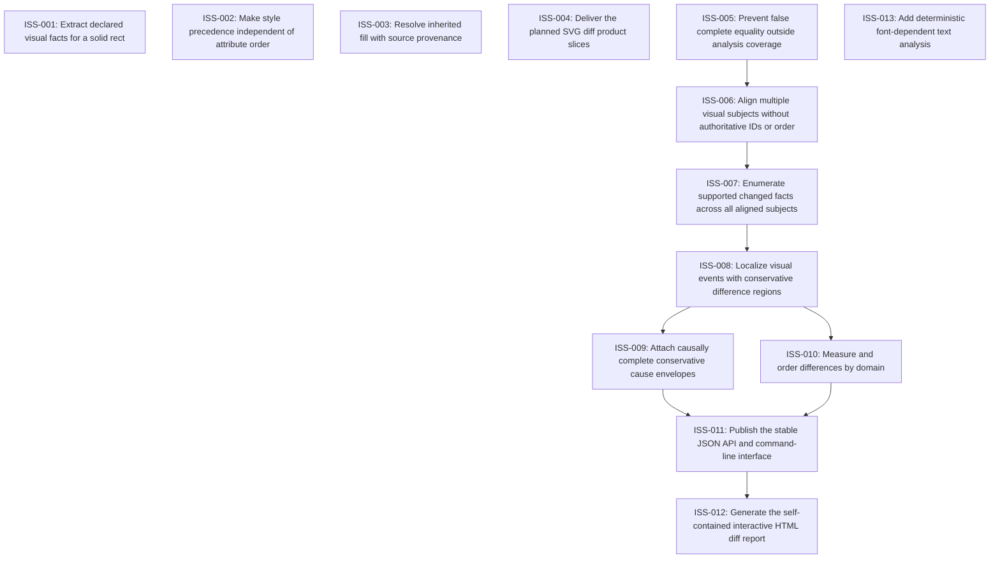

# Markdown Issue Index

Generated by derive-tracker.wasm

## Ready Queue

| ID | Priority | Type | Assignee | Title | Labels |
| --- | ---: | --- | --- | --- | --- |
| [ISS-007](ISS-007.md) | 0 | feature | unassigned | Enumerate supported changed facts across all aligned subjects | core, source-semantics, computed-appearance, tests, agent |

## Unresolved Issues

| ID | Status | Priority | Type | Assignee | Blocked by | Blocks | Title |
| --- | --- | ---: | --- | --- | --- | --- | --- |
| [ISS-004](ISS-004.md) | in_progress | 0 | epic | codex | none | none | Deliver the planned SVG diff product slices |
| [ISS-007](ISS-007.md) | open | 0 | feature | unassigned | none | ISS-008 | Enumerate supported changed facts across all aligned subjects |
| [ISS-002](ISS-002.md) | blocked | 1 | bug | unassigned | none | none | Make style precedence independent of attribute order |
| [ISS-008](ISS-008.md) | open | 1 | feature | unassigned | ISS-007 | ISS-009, ISS-010 | Localize visual events with conservative difference regions |
| [ISS-009](ISS-009.md) | open | 1 | feature | unassigned | ISS-008 | ISS-011 | Attach causally complete conservative cause envelopes |
| [ISS-010](ISS-010.md) | open | 1 | feature | unassigned | ISS-008 | ISS-011 | Measure and order differences by domain |
| [ISS-011](ISS-011.md) | open | 1 | feature | unassigned | ISS-009, ISS-010 | ISS-012 | Publish the stable JSON API and command-line interface |
| [ISS-012](ISS-012.md) | open | 2 | feature | unassigned | ISS-011 | none | Generate the self-contained interactive HTML diff report |
| [ISS-013](ISS-013.md) | deferred | 4 | feature | unassigned | none | none | Add deterministic font-dependent text analysis |

## Dependency Graph

## Warnings

None.
