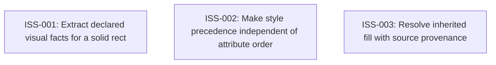

# Markdown Issue Index

Generated by derive-tracker.wasm

## Ready Queue

No ready issues.

## Unresolved Issues

| ID | Status | Priority | Type | Assignee | Blocked by | Blocks | Title |
| --- | --- | ---: | --- | --- | --- | --- | --- |
| [ISS-002](ISS-002.md) | blocked | 1 | bug | unassigned | none | none | Make style precedence independent of attribute order |

## Dependency Graph

## Warnings

None.
